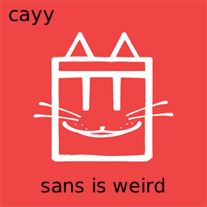

# caysmnlauncher

<p align="center">
  
</p>

<p align="center">
  An alternative to <a href="https://discord.gg/recnet">Meow.Net's</a> launcher for PC.
</p>

> this project is not affiliated with or made by the meow.net developers.

# Why make this?

After Repeating (Meow.Net's Launcher/PC Build developer) released a launcher build that deleted people's entire desktops, and random files on their pc, I didn't want to trust the launcher since Repeating seemed untrustworthy.

# Usage

Download the latest release from releases, extract the zip and open cayymnlauncher.exe.

It is recommended to move the launcher zip into the final location you want it to be before extracting.

# To-Do

Add settings from the original launcher

# Licenses

i dont fucking care do what you want with it lmao


# Building

This app uses nuitka to compile to an exe, make sure you have nuitka installed:
```
pip install nuitka
```

Then, go into build.bat and change anything in the nuitka build command and do: 

```
./build.bat
```

To build with the setup, go to: [Inno Download](https://github.com/jrsoftware/issrc/releases/download/is-7_1_0/innosetup-7.1.0-x64.exe) and run the Inno Setup.

Once you complete the setup, open powershell and run:
``` 
[Environment]::SetEnvironmentVariable("Path", $env:Path + ";C:\Users\YOURWINDOWSUSERNAME\AppData\Local\Programs\Inno Setup 7", "User")  
```
Replace YOURWINDOWSUSERNAME with whatever your windows username is.

Restart your terminals (if using vscode restart it) and it should build properly now!
